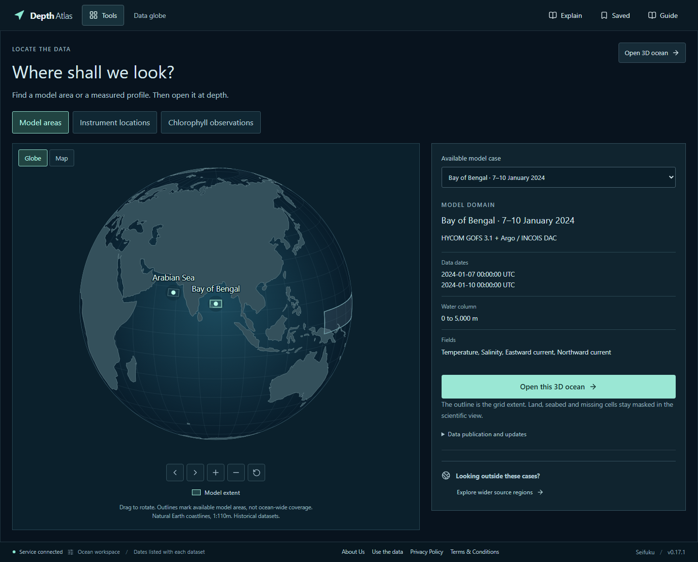

# Depth Atlas


A browser workspace for looking beneath the ocean surface and checking model fields against real instrument measurements. Built by **Team Seifuku**.

**[Open Depth Atlas](https://depth-atlas-seifuku.vercel.app/)** | [About](https://depth-atlas-seifuku.vercel.app/about) | [Privacy](https://depth-atlas-seifuku.vercel.app/privacy) | [Terms](https://depth-atlas-seifuku.vercel.app/terms)



## Technical Documentation

[Documentation index](docs/README.md) | [Full technical documentation (PDF)](docs/Depth_Atlas_Main_Documentation.pdf)

## Start with one investigation

1. Use the globe to choose the January Bay of Bengal dataset. Basic tutorial mode can guide you, or choose **Skip tutorial**.
2. Open **3D ocean**. Rotate the view, turn on the optional cutaway and change the depth. The native-value reading reports the selected source cell.
3. Open **Tools > Instruments** to inspect a measured depth profile alongside the model.
4. Open **Compare**, select a compatible profile and inspect matched values, exclusions and residuals.
5. Save the investigation explicitly. Reopen it to recalculate the result or export it for review.

The globe shows actual dataset bounds and observation positions. It does not imply equal data coverage everywhere. Additional tools and guided feature tours remain available through **Tools** and **Guide**.

## What is included

| Area | Current scope |
| --- | --- |
| Ocean fields | 3D temperature, salinity and horizontal currents; slices, isosurfaces, sections, time steps, colour controls and native values. |
| Observations | Argo, glider, CTD and biogeochemical examples with positions, dates, units and quality flags. Supported NetCDF/CSV imports include preview, compatible mapping and a bounded batch queue. |
| Connected analysis | Model/profile co-display, eligible numerical comparisons, observation support, threshold sensitivity and a guided investigation workflow. |
| Scientific tools | Connected structures, passive-particle drift, sampling experiments, heat and depth, historical climate comparisons, structure evolution and observation exclusion experiments. |
| Reproducibility | Browser-local saves, source hashes, parser/method identity, portable investigation files, checked replay and bounded offline viewers. |
| Interoperability | Native CF NetCDF exchange, REST API and a separate local THREDDS setup for WMS, WCS and OPeNDAP. |
| Learning | Basic and In-depth tutorials perform the real app actions. Basic mode is the default. |

The checked library contains bounded Indian Ocean cases from January and March 2024 and selected tropical Pacific seasons from 2013, 2015 and 2022. Wider-source tools use separately labelled products. These are historical data, not live conditions or operational forecasts. Chlorophyll is available as an observed BGC profile variable; the bundled model does not contain a chlorophyll volume.

## Run locally

Requirements: Python 3.10-3.12, Node.js 22.12 or later in the 22.x line, and npm. Browser users need no local installation. The checked case packs are included and startup requires no provider token.

Windows PowerShell, from the repository root:

```powershell
python -m venv .venv
.venv/Scripts/python.exe -m pip install -r requirements.txt
npm --prefix web ci
npm --prefix web run build
.venv/Scripts/python.exe -m science.publication --candidate casepacks --manifest api/publication.json
.venv/Scripts/python.exe -m uvicorn api.app:app --host 127.0.0.1 --port 8000
```

On Linux or macOS, use `.venv/bin/python` in place of `.venv/Scripts/python.exe`. The verified local host is Windows x64; the hosted Python runtime is Linux. Open **http://127.0.0.1:8000**. Restart after changing the app release or publication. For frontend development, run the API on port 8000 and `npm --prefix web run dev` in another terminal, then open port 5173.

The frontend uses React, TypeScript, Vite, Three.js and D3. FastAPI serves bounded scientific operations using NumPy, netCDF4 and GSW. xarray and source acquisition belong to the separate scientific preparation environment.

## Verify

```powershell
.venv/Scripts/python.exe -m pip install -r requirements-science.txt
.venv/Scripts/python.exe -m pytest tests -q
npm --prefix web run test:science
```

The scientific requirements include the test dependencies. Some source-reference tests need original archives acquired by the documented preparation commands; those archives are not included here. Missing source-reference checks are skipped or require those explicit prerequisites, not counted as passing. [Methods and preparation notes](docs/METHODS.md) describe these boundaries.

To run browser checks against a running local server:

```powershell
node web/node_modules/@playwright/test/cli.js install chromium
$env:OCEAN_TEST_URL = 'http://127.0.0.1:8000'
node web/node_modules/@playwright/test/cli.js test --config=web/playwright.config.ts --project=chromium-desktop
```

For a focused current-brand and save/replay check, run `node web/benchmarks/depth-atlas-branding.mjs` with the same environment variable. Historical verifiers remain available for their documented inputs. They are not promises that every old external service or report fixture remains current.

## Deployment and storage

The production app runs on Vercel with a same-origin API. `vercel.json` and `deploy/prepare_vercel.py` build and package the app. Link your own hosting project before deploying; no account credentials or private hosting identifiers are included. `deploy/Dockerfile` and `deploy/compose.yaml` provide a separate portable recipe. The container recipe is provided but has not been executed on the development host. The [standards server](deploy/standards/README.md) requires a persistent Java service and is separate from Vercel.

Investigations are saved locally in the browser only when the user asks. Imported files are processed temporarily by the API; there is no account system or durable cloud upload database. Moving to a different website address requires exporting and importing saved investigations because browser storage is origin-specific.

## Scientific and security limits

Model fields, measurements, derived results and simulations are labelled separately. Model-observation agreement is not automatically independent validation because the model can assimilate observations. Coverage is not confidence, threshold sensitivity is not probability, and structure correspondence does not establish that the same water moved between locations. The app has not established operational forecast improvement or institutional acceptance.

The API has bounded request sizes, upload deadlines, finite concurrency and per-worker rate controls. Those counters are not a distributed firewall. See [Security controls and reporting](SECURITY.md). Physical-device coverage, unfamiliar-user comprehension and independent oceanographic review remain external validation work.

This repository is the initial public source release. Private planning files, deployment logs and earlier repository history are not included. Numerical case-pack bytes remain unchanged. Compatibility fixture links point to the current data address; their calculations, replay recipes and integrity hashes are preserved. [Release scope](docs/RELEASE.md) records verification of this package.

## Team and credits

**Adwita Kurle** is the team leader. **Gaurav Ranade** is the website creator and operator. Team members also include Anushree Dixit, Spruha Kurle, Hrishikesh Tarade and Tanisha Natrajan.

Contact: **ranadegaurav30@gmail.com**, Pune, Maharashtra, India. The project is independent and has no university affiliation.

Source datasets retain their original providers, dates, definitions and attribution in the case manifests. [Third-party notices](web/public/third-party-notices.txt) retain software and data credits. No blanket open-source licence has been selected for the team's original code. Public availability permits review under the hosting service's terms; it does not change the separate licences of source datasets and dependencies.
